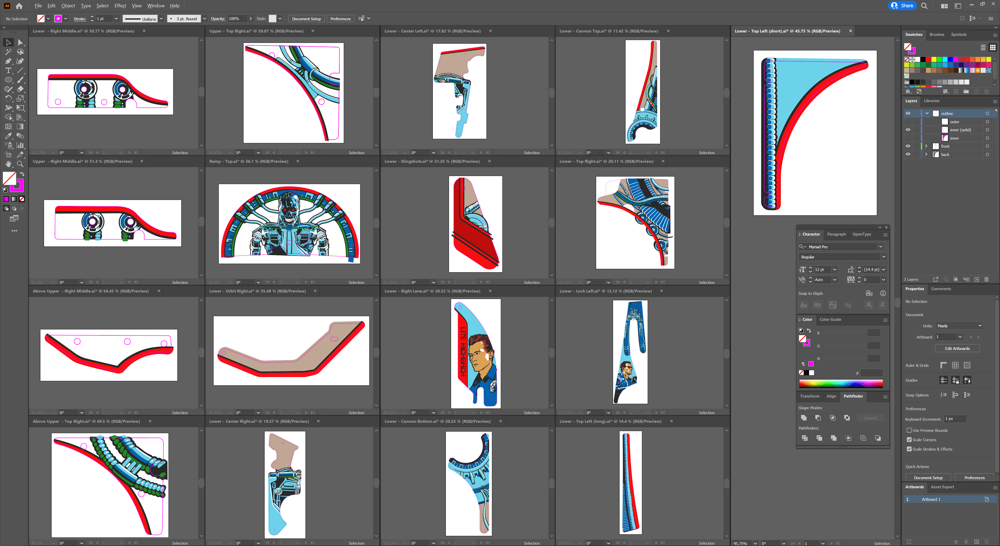
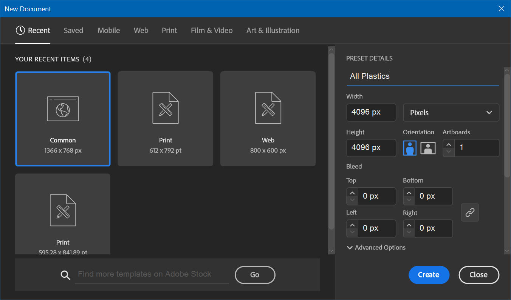
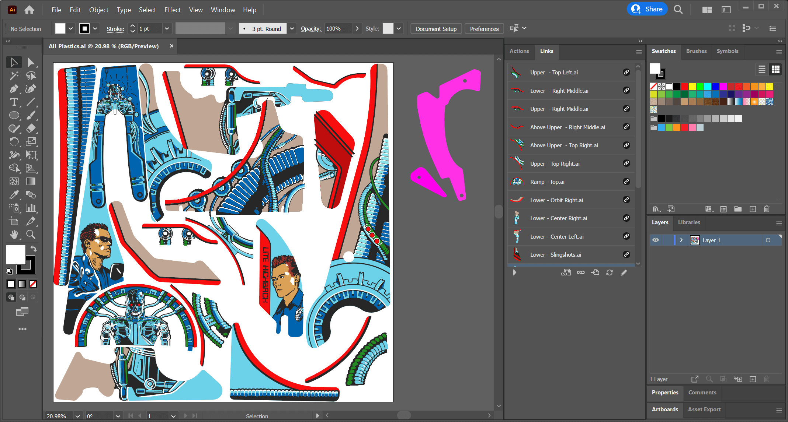
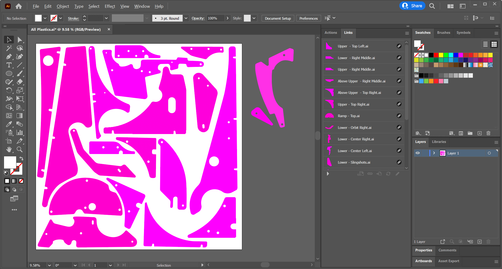

# Prepare Artwork

The goal of the first step is to prepare the artwork in a way it's easily exportable and can be re-exported without having to go through the other steps. We're going to use Adobe Illustrator for this.

As mentioned in the introduction, we're aiming for a single texture that contains all plastics. The advantage is that this way, less texture data needs to be transferred to the graphics card and only one material instance must be instantiated. It also allows you to process everything together, versus having to repeat this workflow for every plastic separately.

## Step 1: Create Artwork

There are many ways to create artwork. If you're working on an original game, you might draw it using a drawing software. For recreations where you have access to the physical machine, you might disassemble the plastics and scan them or take pictures with a good camera. If you don't have access to the physical plastics, you might get good sources by searching on the internet.

> [!note]
> If you're using a camera, be sure to remove any lens distortion with [Camera Raw](https://helpx.adobe.com/camera-raw/using/supported-cameras.html) or similar software. For images found online, you will probably have to manually un-distort the image.

For optimal quality, two things are important when dealing with source material not coming directly from a scanner:

1. Distortion: You'll be extracting the 3D mesh from the outline of your 2D artwork. If the artwork is distorted, you won't be able to fit the plastic on the playfield.
2. Colors: Since Unity is applying lights to the scene, the colors in the texture should be neutral. That means that lights that leak into the texture will negatively influence the final render.

Once you have an image of the plastic, you need to decide whether you will be using it as-is, or whether you're going to redraw it. Depending on the type of artwork, redrawing might not possible or a huge effort, and "cleaning it up" in Photoshop will do it. The advantage of redrawing it is that you can produce arbitrary large textures and make the colors match perfectly.

> [!note]
> Speaking of colors, it's best to use PBR-compatible colors, meaning your texture shouldn't contain absolute blacks or whites, and the brightness of other colors should be at around 95% max. For black, we're using `#272727` and for white `#f4f5f0`.

The T2 table we're using in this tutorial contains exclusively vector art, so we've created an `.ai` file per plastic:

Note the pink outlines. They sit on a separate layer and can be easily toggled. They should contain drill holes for the screws as well, as they are visible due to the plastic being transparent and the ink actually sitting below the plastic.

Since our first step is to create the texture, hide the outlines and save all your files.

> [!note]
> If you're using pixel-based sources for the plastics, don't worry about the outlines just yet. ;)

## Step 2: Arrange Artwork

Now we have one file per plastic, we'll place them into a single document that we can render out as a texture. For this, create a new, square document in Illustrator. Depending on the size and number of plastics you might want to change this later but give it a width and height of 4096 pixels for now. Let's call it `Plastics.ai`.

Since we're creating the texture, we don't need the pink outlines. So, before continuing, open all of your source files, hide them, and save them.

As we might update our original files later, we won't copy and paste our plastics into this document but *link them* instead. In order to do this, go to *File -> Place...* and select all your plastics. Then arrange them in a way so there's as little white space as possible remaining. 

> [!note]
> In order for the plastics to have a similar pixel density, we recommend keeping the proportional size of the plastics approximately the same, i.e., larger plastics should take more space than smaller ones.

Your artboard should now look something like this:

Note the *Links* toolbox that shows the individual plastic files. Also note the pink surfaces on the right, outside the artboard. These are plastics that don't have any artwork, i.e., blank, transparent pieces. We keep them here because we want to generate meshes as well, but don't need it in the texture, which is defined by the artboard.

> [!warning]
> Verify that the outlines on the artboard are hidden. This is the version we'll create the texture with, and we don't want to leak the outlines onto the final texture.

## Step 3: Export Texture and Outlines

We'll first export the texture. In Illustrator, click on *File -> Export -> Export As...*, and make sure *Use Artboards* is checked. As type, select *PNG*. Then, enter `Plastics.png` as file name and click on *Export*, which will result in the dialog seen in the screenshot.

Since you've set the resolution to 4096 × 4096 pixels when you've created the document, and the default pixel density is 72dpi, choose 72dpi. This should result in a PNG file at 4096 × 4096 pixels.

> [Note!]
> When I exported it when writing this tutorial, Illustrator exported it as 4097 × 4097 🤦‍♂. So, I ended up exporting it with a slightly higher resolution and sizing it down in Photoshop.

### Outlines

The goal of having outlines in the artwork is so that we can extract the mesh from it, and it allows us to align the artwork perfectly on the surface. We're going to export the outlines as solid surfaces in the SVG format. The result we can then import into Blender.

In order to do that, open all your artwork files, hide the actual artwork, and only show the outline. Make it **one single solid surface per plastic**, meaning if you have holes, you need to remove them from the parent curve.

> [Note!]
> If your artwork are pixel graphics, draw your outlines directly into `Plastics.ai`. We recommend putting them on a separate layer, so you can toggle them easily.

Your document should now look like this:

Don't worry about the color, it just needs to be filled in any color. I'm using magenta because it gives a good contrast to the rest of the artwork. 

Click on *File -> Save a Copy...*, enter `Plastics.svg` as file name, save as type *SVG* and make sure *Use Artboards* is unchecked this time. Click on *Save*. In the options panel, click on *More Options* and make sure all the options are disabled as shown in the screenshot.

You're now ready to [create the meshes](xref:tutorial_plastics_2).
