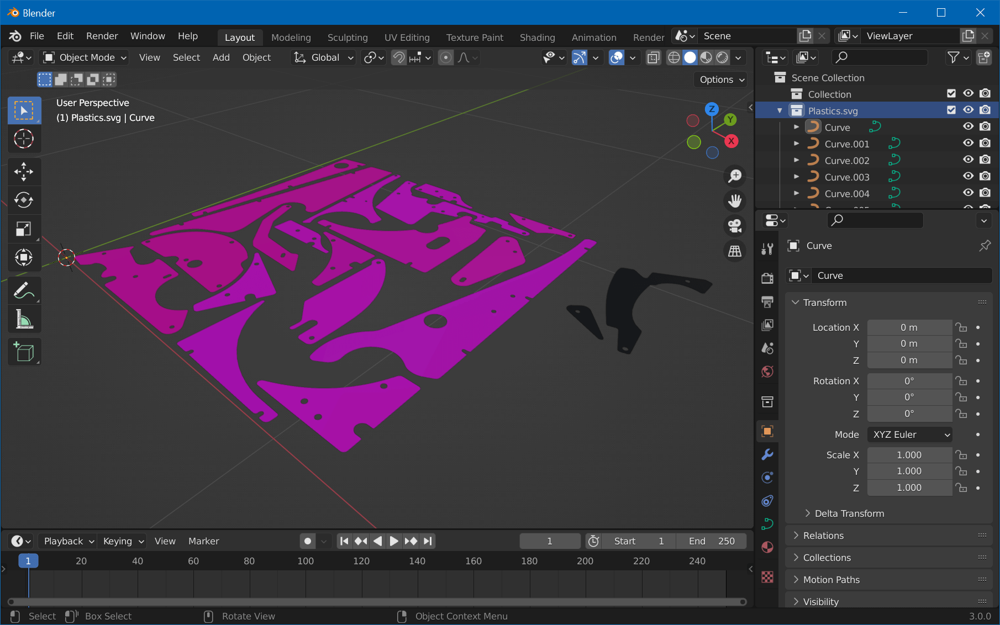
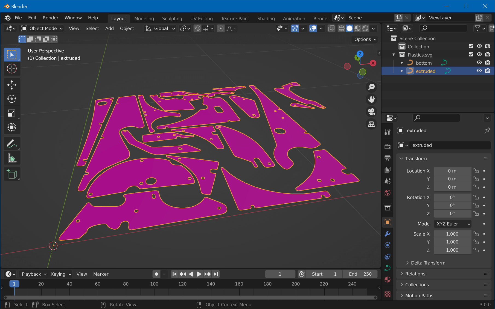
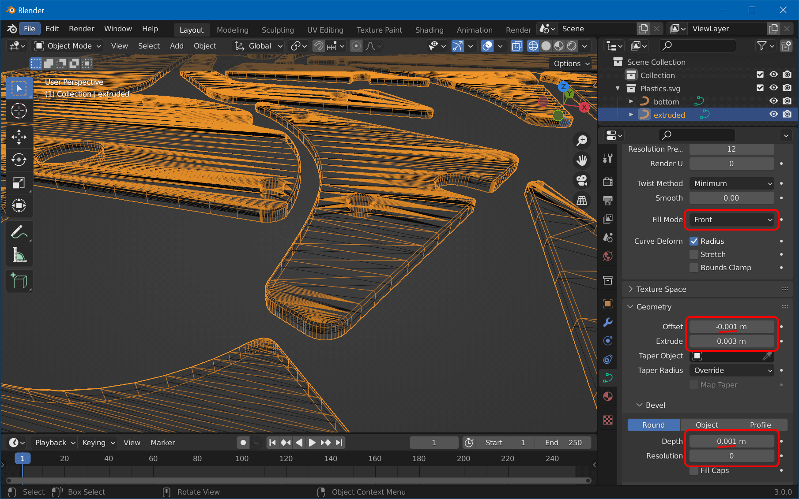
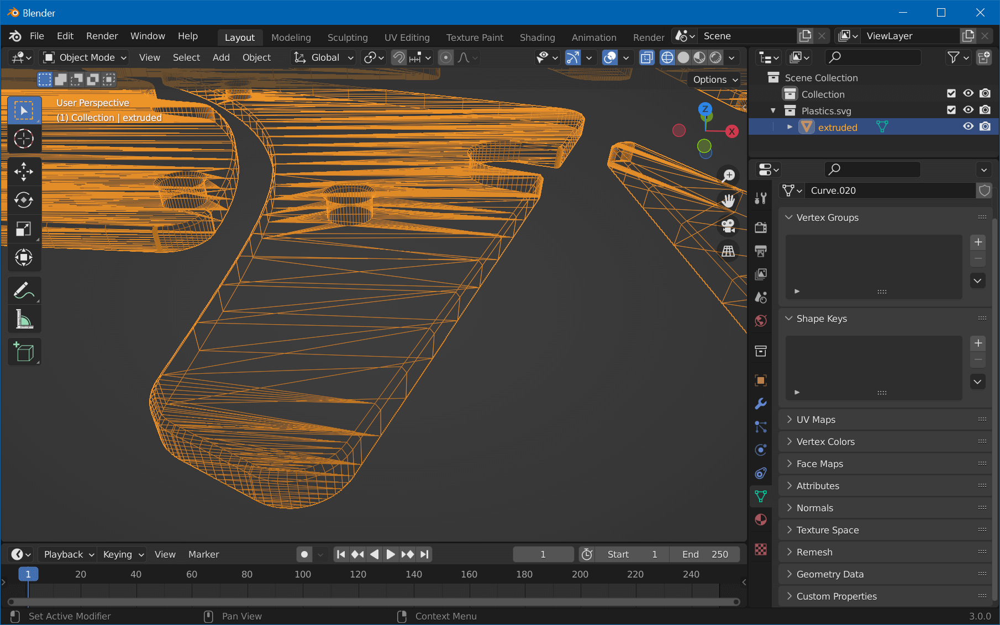

# Create Mesh

We're now going to import the SVG created in the [previous step](xref:tutorial_plastics_1) and create a mesh that is beveled on the top.

## Step 1: Import

Open Blender, clear the scene with `A`, `X`, `Enter`. Then, click on *File -> Import -> Scalable Vector Graphics (.svg)*, navigate to where you've saved the SVG in the previous step, select `Plastics.svg`, and hit *Import*.

You might not see much due to the imported size. If there were no errors, you should see your imported plastics in the Outliner. Select them and press `.` on the numpad (not the main keyboard) while hovering over the 3D viewport to zoom in. 

> [!note]
> You might run into another issue due to the size of the plastics: Camera clipping. To fix that, press `N` with your cursor over the 3D Viewport, select *View* and set something like 0.001m for *Clip Start*.

Your viewport should look like this now:

## Step 2: Setup

The way we're going for this is to extrude and bevel our SVG on one side only. This however results in the bottom faces missing. To fix that, we'll duplicate our SVG and use one for extrusion and the other for the bottom mesh.

Before we start, let's make it one single object so we can easily apply everyting we do in one step. Select one element, hit `A` for select all, then `Ctrl`+`J` for joining all curves.

Hit `Shift`+`D`, `Esc` to duplicate at the same position. In the *Outliner*, let's name our objects "bottom" and "extruded":

## Step 3: Extrude

Select "extruded" in the outliner and click on the *Object Properties* tab in the *Properties* view on the right side. Under *Geometry*, there is an *Extrude* field, and a bit below a *Bevel* section.

Now, the *Extrude* value is difficult to judge. If you have access to the physical plastics, you can calculate the scale between the real world and the object in Blender by physically measuring the size of a plastic and dividing it by the measured value in Blender. Then, also measure the thickness of the real-world plastic and multiply it by that factor. Personally, I just eyeballed it and ended up with 0.003 m for the *Extrude* value and 0.001 m for the *Bevel Depth*.

Then there are three more properties to change:

- We only want to extrude the front, so set *Fill Mode* to *Front*.
- We don't want to make the object larger by bevelling, so enter the negative value of the bevel depth under *Offset*.
- Finally, a *Resolution* of `0` will do.

Here are all the non-default options in red:

## Step 4: Convert, Join and Clean

As seen in the previous screenshot, our bottom object now sits in the middle of the extruded mesh. Let's fix that by typing `G` (move), `Z` (on z-axis only), and the extrude value of the previous step, in our case `0.003`, followed by `Enter`.

Then type `A` to select all objects, choose *Object -> Convert -> Mesh*, and hit `Ctrl`+`J` to join them all. Finally, clean up the duplicated vertices from the extrusion by hitting `Tab` for edit mode, `A` to select all vertices, and choose *Mesh -> Clean Up -> Merge by Distance*.

Exit edit mode and this is how it should look:

If that's the case, congrats, you're done with the meshes! Maybe now it's a good moment to save your Blender file. `Ctrl`+`S` and enter `Plastics.blend`. 

In the [next part](xref:tutorial_plastics_3) of this tutorial, we're going to UV-Map them.
